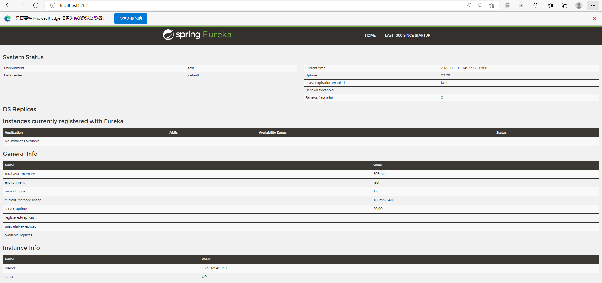
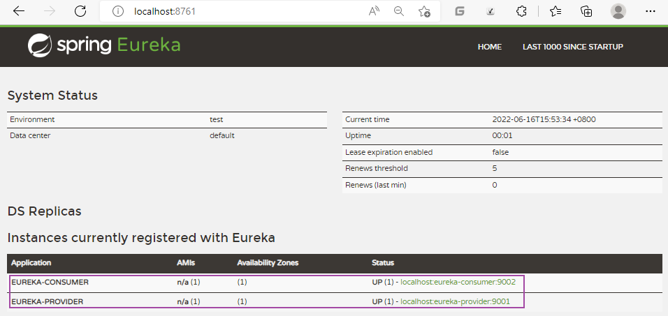

Eureka 简单入门

1.搭建 Provider  和 Consumer 服务。

2.使用 RestTemplate 完成远程调用。

3.搭建 Eureka Server 服务。

4.改造 Provider  和 Consumer 称为 Eureka Client。

5.Consumer 服务 通过从 Eureka Server 中抓取 Provider 地址 完成 远程调用。

## 1.搭建 Provider  和 Consumer 服务
### 1.1 创建spring-cloud-parent项目
### 1.2 配置parent项目pom.xml
详情参照：资料/1项目搭建/parent-pom.xml
```xml

    <parent>
        <groupId>org.springframework.boot</groupId>
        <artifactId>spring-boot-starter-parent</artifactId>
        <version>2.1.0.RELEASE</version>
        <relativePath/>
    </parent>


    <properties>
        <project.build.sourceEncoding>UTF-8</project.build.sourceEncoding>
        <project.reporting.outputEncoding>UTF-8</project.reporting.outputEncoding>
        <java.version>1.8</java.version>
    </properties>

```
### 1.3 parent下创建eureka-provider模块
#### (1)配置pom.xml
详情参照：资料/1项目搭建/provider-pom.xml
```xml

    <dependencies>
        <dependency>
            <groupId>org.springframework.boot</groupId>
            <artifactId>spring-boot-starter-web</artifactId>
        </dependency>
    </dependencies>

```
#### (2)编写提供方代码（启动类，entity，dao，service，controller）

略

#### (3)启动Provider


> 测试结果：确保能够通过浏览器访问到接口数据

### 1.4 parent下创建eureka-consumer模块
#### (1)配置pom.xml
详情参照：资料/1项目搭建/provider-pom.xml
```xml

    <dependencies>
        <dependency>
            <groupId>org.springframework.boot</groupId>
            <artifactId>spring-boot-starter-web</artifactId>
        </dependency>
    </dependencies>

```

#### (2)编写消费方代码（启动类，entity，controller）
> controller暂时不写调用提供方http接口的代码，即restTemplate部分

## 2.使用 RestTemplate 完成远程调用
### 2.1 引入RestTemplate
#### (1)定义Bean
在spring的配置类中，定义：
```java
// restTemplate使用：1.定义Bean
@Configuration
public class RestTemplateConfig {

    @Bean
    public RestTemplate restTemplate() {
        return new RestTemplate();
    }
}
```
#### (2)注入Bean
```java
// OrderController.java
// restTemplate使用：2.注入Bean
@Autowired
private RestTemplate restTemplate;
```
#### (3)调用方法
```java
// OrderController.java
@GetMapping("/goods/{id}")
public Goods findGoodsById(@PathVariable("id") int id) {
    // 使用restTemplate调用
    // restTemplate使用：3.调用方法 localhost:9001为服务提供方ip和端口
    return restTemplate.getForObject("http://localhost:9001/goods/"+id, Goods.class);
}
```

### 2.2 启动服务
启动eureka-consumer服务和eureka-provider服务
> 测试结果：确保请求consumer服务接口，能够获取到provider服务数据

## 3.搭建 Eureka Server 服务
### 3.1 在parent项目下，创建 eureka-server 模块
### 3.2 parent项目引入 SpringCloud 依赖
详情参照：资料/2Eureka搭建/parent-pom.xml
```xml

    <properties>
        <spring-cloud.version>Greenwich.RELEASE</spring-cloud.version>
    </properties>

    <dependencyManagement>
        <dependencies>
            <dependency>
                <groupId>org.springframework.cloud</groupId>
                <artifactId>spring-cloud-dependencies</artifactId>
                <version>${spring-cloud.version}</version>
                <type>pom</type>
                <scope>import</scope>
            </dependency>
        </dependencies>
    </dependencyManagement>

```
### 3.3 eureka-server模块引入 Eureka Server 相关依赖
详情参照：资料/2Eureka搭建/eureka-server.xml
```xml

    <dependencies>
        <dependency>
            <groupId>org.springframework.boot</groupId>
            <artifactId>spring-boot-starter-web</artifactId>
        </dependency>
		<!-- eureka-server -->
		<dependency>
            <groupId>org.springframework.cloud</groupId>
            <artifactId>spring-cloud-starter-netflix-eureka-server</artifactId>
        </dependency>
    </dependencies>

```
### 3.3 eureka-server模块启动类

### 3.4 添加 Eureka Server 标识
在启动类上添加 `@EnableEurekaServer` 注解，表示该模块是一个Eureka Server

### 3.3 Eureka Server相关配置
在application.yml配置文件中添加：
```yaml
server:
  port: 8761 # Eureka Server 默认端口

# eureka 配置
# eureka 一共有4部分 配置
# 1. dashboard:eureka的web控制台配置
# 2. server:eureka的服务端配置
# 3. client:eureka的客户端配置
# 4. instance:eureka的实例配置

eureka:
  instance:
    hostname: localhost # 主机名
  client:
    service-url:
      defaultZone: http://${eureka.instance.hostname}:${server.port}/eureka # eureka服务端地址，将来客户端使用该地址和eureka进行通信

    register-with-eureka: false # 是否将自己的路径 注册到eureka上。eureka server 不需要的，eureka provider client 需要
    fetch-registry: false # 是否需要从eureka中抓取路径。eureka server 不需要的，eureka consumer client 需要
```
> 注意：service-url 并不是用于接收eureka服务端地址的，而是其下的defaultZone，并且defaultZone在idea中不会有任何提示，需要记住他


### 3.4 启动该模块
浏览器访问Eureka Server服务
```shell
# localhost 为 Eureka Server的ip
http://localhost:8761
```

服务启动成功



## 4.改造 provider  和 consumer 成为 Eureka Client
### 4.1 provider、consumer模块引入依赖
pom.xml
详细参照：资料/2Eureka搭建/provider-pom.xml
```xml
		<!-- eureka-client  -->
		<dependency>
            <groupId>org.springframework.cloud</groupId>
            <artifactId>spring-cloud-starter-netflix-eureka-client</artifactId>
        </dependency>
```

### 4.2 provider、consumer模块添加 Eureka Client 标识
在启动类上添加 `@EnableEurekaClient` 注解，表示该模块是一个Eureka Client
> 这个注解在最新版本中无需添加，其中包含本学习项目的版本，为了识别性，建议还是要添加一下

### 4.3 Eureka Client相关配置
eureka-consumer application.yml（正式情况下，该模块既有可能是消费方，也有可能是提供方，所以register-with-eureka、fetch-registry 都使用默认配置【default=ture】）
```yaml
server:
  port: 9002
  
eureka:
  instance:
    hostname: localhost # 主机名
  client:
    service-url:
      defaultZone: http://localhost:8761/eureka # eureka服务端地址，将来客户端使用该地址和eureka进行通信
spring:
  application:
    name: eureka-consumer # 设置当前应用的名称。将来会在eureka中Application显示。将来需要使用该名称来获取路径
```

eureka-provider application.yml（正式情况下，该模块既有可能是提供方，也有可能是消费方，所以register-with-eureka、fetch-registry 都使用默认配置【default=ture】）
```yaml
server:
  port: 9001
  
eureka:
  instance:
    hostname: localhost # 主机名
  client:
    service-url:
      defaultZone: http://localhost:8761/eureka # eureka服务端地址，将来客户端使用该地址和eureka进行通信
spring:
  application:
    name: eureka-provider # 设置当前应用的名称。将来会在eureka中Application显示。将来需要使用该名称来获取路径
```

### 4.4 启动服务
依次启动 eureka-server、eureka-provider、eureka-consumer

访问 Eureka Server 控制台： http://localhost:8761

Eureka Server多出了两个应用：




## 5.consumer 服务 通过从 Eureka Server 中抓取 provider 地址 完成 远程调用（DiscoveryClient）
使用DiscoveryClient动态从EurekaServer中获取url
### 5.1 引入DiscoveryClient
#### (1)注入Bean
```java
// OrderController.java
// discoveryClient使用：1.注入Bean 注入的是 org.springframework.cloud.client.discovery 包下的
@Autowired
private DiscoveryClient discoveryClient;
```

#### (2)激活该对象
在consumer启动类上添加 注解 `@EnableDiscoveryClient`

#### (3)调用方法
```java
    // eureka-consumer OrderController.java
    @GetMapping("/goods/{id}")
    public Goods findGoodsById(@PathVariable("id") int id) {
        // discoveryClient使用：3.调用方法 动态获取提供方ip和端口 EUREKA-PROVIDER为提供方应用名
        List<ServiceInstance> instances = discoveryClient.getInstances("EUREKA-PROVIDER");
        // EurekaServer中是否有EUREKA-PROVIDER
        if (instances == null || instances.size() == 0) {
            // 没有
            return null;
        }
        ServiceInstance provider = instances.get(0);
        String host = provider.getHost();
        int port = provider.getPort();

        String url = "http://" + host + ":" + port + "/goods/" + id;

        // 使用restTemplate调用
        // restTemplate使用：3.调用方法
        return restTemplate.getForObject(url, Goods.class);
    }

```

### 5.2 启动服务
依次启动 eureka-server、eureka-provider、eureka-consumer，测试consumer调用provider服务是否运行正常


