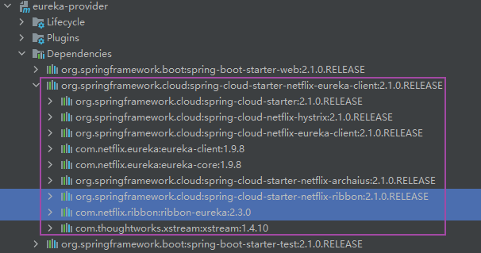
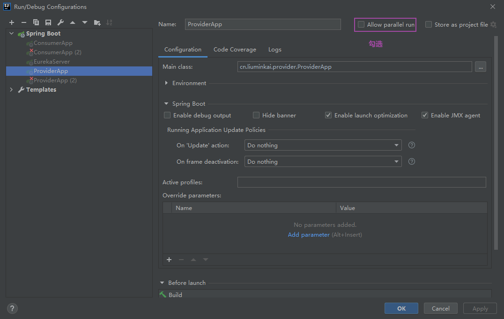
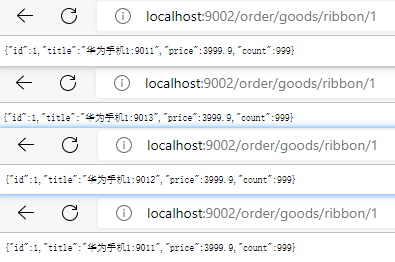

作用：
1.简化远程调用
2.客户端负载均衡
服务端与客户端负载均衡的区别
Nginx服务端负载均衡
3.ribbon是集成在eureka中的
4.负载均衡策略


负载均衡，服务提供方只有一个模块，可以这样，先使用9000启动，再使用9001启动，那么就有两个服务了
但是启动另一个时会停止之前的服务，所以需要做如下配置
为了更好区分提供方和显示负载均衡的效果，这里加入一个server.port参数，并添加到返回实体上

### 快速入门
#### 1.环境搭建

因为ribbon是集成在eureka中的，引入eureka依赖后，无需导入ribbon的依赖，所以本次demo都将基于eureka展开。



拷贝 “Eureka-01快速入门-5.consumer服务通过EurekaServer获取url访问provider” 内容到 “Ribbon-01快速入门”，暂时无需对配置进行修改。


#### 2.在定义RestTemplate对应Bean时，除了@Bean注解，还添加一个注解：@LoadBalanced
```java
// eureka-consumer
// restTemplate使用：1.定义Bean
@Configuration
public class RestTemplateConfig {

    // ribbon使用：1.RestTemplate定义添加 @LoadBalanced 注解
    @LoadBalanced
    @Bean
    public RestTemplate restTemplate() {
        return new RestTemplate();
    }
}

```
> 使用@LoadBalanced以后，就无法使用 ip:port 方式访问服务提供方，因为ribbon会认为 ip:port 是一个instance，这个instance在EurekaServer是不存在的，进而会报错


#### 3.在使用RestTemplate调用方法时，使用 服务提供方应用名 替换 host:port （简化远程调用）
```java
public class OrderController {
    // ...
    
    /**
     * ribbon使用：2.不再从discoveryClient中动态获取ip:port，直接在RestTemplate方法调用中使用 服务应用名 替换 ip:port (简化远程调用)
     */
    @GetMapping("/goods/ribbon/{id}")
    public Goods findGoodsByIdUseRibbon(@PathVariable("id") int id) {

        // ribbon简化远程调用
        String url = "http://EUREKA-PROVIDER/goods/" + id;

        // 使用restTemplate调用
        // restTemplate使用：3.调用方法
        return restTemplate.getForObject(url, Goods.class);
    }
}

    // ...
```

#### 4.简化远程调用测试
依次启动服务 eureka-server、eureka-provider、eureka-consumer

确保eureka-server控制台中服务是完整的

确保eureka-consumer能通过ribbon简化过的接口访问到eureka-provider


#### 5.客户端负载均衡测试
要想完成负载均衡的测试，我们需要对 eureka-provider 进行一些改造，让我们能够清晰的看到负载均衡所表现的效果。首先，要有负载均衡效果
，必须有多个提供方服务（相同应用），而这里只有一个服务，那么将采用 修改端口 启动多个服务的策略，完成多个提供方服务的启动。其次，为了让
客户端调用有更好的显示效果，会将 服务的端口 添加到 返回的对象中。

##### (1) 为GoodsController.java findOne添加端口到返回的对象中
```java
public class GoodsController {

    @Autowired
    private GoodsService goodsService;

    @Value("${server.port}")
    private String port;

    @GetMapping("/goods/{id}")
    public Goods findOne(@PathVariable("id") int id) {
        Goods one = goodsService.findOne(id);
        // 将服务端口添加到返回对象中
        one.setTitle(one.getTitle() + ":" + port);
        return one;
    }
}
```

##### (2) 多次修改端口启动provider服务
依次启动 eureka-server（8761）、eureka-provider（port:9011）、eureka-provider（port:9012）、eureka-provider（port:9013）、eureka-consumer（9002）

> 注意: 启动另一个时会停止之前启动的服务，所以需要做如下配置
>
> 

经过多次调用，发现三个provider轮询提供服务，下面取前4次结果：




### 负载均衡策略
- 随机: RandomRule
- 轮询（默认）: RoundRobinRule
- 最小并发: BestAvailableRule 访问最闲
- 过滤: AvailabilityFilteringRule 并发高，坏节点过滤掉
- 响应时间: WeightedResponseTimeRule 发一个不影响带宽的小数据包，查看那个最快响应
- 轮询重试: RetryRule 默认轮询，当服务全挂了，就会轮询10次，发现仍然没有就响应失败，轮询重试就加一轮，共11轮
- 性能可用性: ZoneAvoidanceRule

#### 设置负载均衡策略
以随机策略为例：RandomRule
##### 1.方式一:编码
1.1 在客户端启动类上添加RibbonClient注解，属性name=需要负载均衡提供方服务名，configuration=指定LBRuleConfiguration.class
```java
@RibbonClient(name = "eureka-provider", configuration = LBRuleConfiguration.class)
public class ConsumerApp {
    //...
}
```
1.2 客户端LBRuleConfiguration配置，并使用@Bean 注册对应的规则类（IRule rule()）
```java

@Configuration
public class LBRuleConfiguration {

    @Bean
    public IRule rule() {
        return new RandomRule();
    }
}

```
##### 2.方式二:配置（优先级高于编码）
在客户端配置文件中配置 application.yml
```yaml
服务提供方的应用名:
    ribbon:
        NFloadBalancerRuleClassName: Rule全限定名
```
demo：
```yaml
# 配置的方式设置Ribbon的负载均衡策略
eureka-provider: # 设置的服务提供方的 应用名称
  ribbon:
    NFLoadBalancerRuleClassName: com.netflix.loadbalancer.RandomRule
```
> 注意：上面配置没有任何提示信息，需要记忆，而且NFLoadBalancerRuleClassName不要写错了

#### 测试负载均衡策略
与“5.客户端负载均衡测试”一致，查看是否是随机分配请求
localhost:9002/order/goods/1