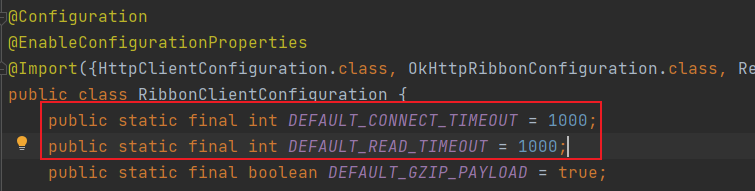
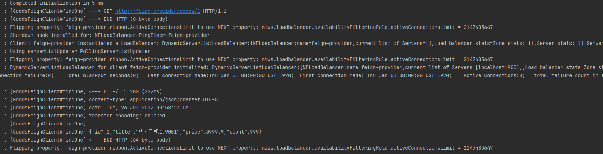

声明式服务调用组件   feign的接口怎么装载到Spring中的？？？？？
客户端
不支持SpringMVC的注解，但SpringCloud对其分钟，支持了SpringMVC的注解，也就是OpenFeign

ribbon 虽然简化了eureka的调用，但是我们每次调用都需要写一个url（含服务名），再使用restTemplate调用，调用过程还是比较繁琐，每次都得写一遍url

环境搭建，ribbon 改服务，应用名


环境搭建：，修改eureka-client模块名前缀为feign，和对应模块应用名，修改父模块pom.xml


feign可以进一步简化ribbon+restTemplate，feign是进一步的封装
### 快速入门

#### 1.环境搭建
##### (1) 完成模块复制
拷贝 “springcloud-04-ribbon 01快速入门 2.客户端负载均衡”下spring-cloud-parent 到 “springcloud-05-feign 01快速入门”

##### (2) eureka-consumer，eureka-provider模块重命名为feign前缀

##### (3) 修改pom.xml和application.yml
###### 修改module的名字
spring-cloud-parent的pom.xml
```xml

<modules>
  <module>feign-provider</module>
  <module>feign-consumer</module>
  <module>eureka-server</module>
</modules>

```

consumer模块（port:9002）pom.xml
```xml
<artifactId>feign-consumer</artifactId>
```

provider模块（port:9001）pom.xml
```xml
<artifactId>feign-provider</artifactId>
```

###### feign-consumer，feign-provider修改应用名
consumer模块（port:9002）application.yml
```yaml
spring:
  application:
    name: feign-consumer
```

provider模块（port:9001）application.yml
```yaml
spring:
  application:
    name: feign-provider 
```

##### (4) 服务消费方（feign-consumer）引入openfeign依赖
```xml
<dependencies>

  <!--feign-->
  <dependency>
    <groupId>org.springframework.cloud</groupId>
    <artifactId>spring-cloud-starter-openfeign</artifactId>
  </dependency>

</dependencies>
```

##### (5) 可选，修改服务消费方，OrderController.java，调用url的服务名
EUREKA-PROVIDER 改为 FEIGN-PROVIDER

#### 2.服务消费方启动类上开启Fegin的功能（声明式接口）
```java
@EnableFeignClients //开启Feign的功能
public class ConsumerApp {
    // ...
}
```


#### 3.服务消费方，写一个XxxFeginClient接口
XxxFeiginClient作用：
1. 发起远程调用
2. 简化ribbon代码

##### (1) 定义接口
新建包名为feign的包，在该包下创建GoodsFeignClient接口

##### (2) 接口添加注解@FeignClient，属性value=服务提供方应用名
```java
// openFeign使用：1. 定义接口 2. 接口上添加注解
@FeignClient(value = "feign-provider")
public interface GoodsFeignClient {
}
```

##### (3) 编写调用接口（接口方法），接口的声明规则和提供方接口保持一致（返回对象类型可以不同）
```java
// openFeign使用：1. 定义接口 2. 接口上添加注解
@FeignClient(value = "feign-provider")
public interface GoodsFeignClient {

    // openFeign使用：3. 编写调用接口，接口的声明规则 和 提供方接口保持一致。
    @GetMapping("/goods/{id}")
    Goods findOne(@PathVariable("id") int id);
}
```

#### 4.本地controller调用feign接口，完成远程调用（注入爆红，不用管，能使用就行）
```java
public class OrderController {

    // openFeign使用：4.1 注入该接口对象
    @Autowired
    private GoodsFeignClient goodsFeignClient;

    @GetMapping("/goods/feign/{id}")
    public Goods findGoodsByIdUseFeign(@PathVariable("id") int id) {
        // openFeign使用：4.2 调用接口方法完成远程调用
        return goodsFeignClient.findOne(id);
    }
}
```

#### 5.启动测试
依次启动 eureka-server、feign-provider、feign-consumer，确保consumer成功调用provider服务
http://localhsot:9002/order/goods/feign/1

### 其他功能
都在 consumer 上配置
#### 1.超时设置
环境搭建：拷贝 01快速入门
消费方调用提供方超时时间默认1s（ribbon）



##### (1) 配置
feign-consumer的application.yaml

配置方式一：直接使用ribbon
```yaml
ribbon:
  ConnectTimeout: 5000 # 连接超时时间，ms
  ReadTimeout: 5000 # 逻辑超时时间，ms
```

配置方式二：使用feign里的ribbon
```yaml
feign:
  client:
    config:
      default:
        ConnectTimeout: 5000 # 连接超时时间，ms
        ReadTimeout: 5000 # 逻辑超时时间，ms

```

> 注意：ConnectTimeout和ReadTimeout不会提示，需要记住
##### (2) 启动测试
###### 连接超时 ConnectTimeout
仅仅启动 eureka-server和feign-consumer，发起请求，如果经过5s后才报错，代表配置成功
请求url：http://localhost:9002/order/goods/feign/1
报错信息：Connection refused: connect executing GET http://feign-provider/goods/1

###### 逻辑超时 ReadTimeout
全启动，发起请求，在feign-consumer的调用接口方法中延时4s不报错，延时6s报错，代表配置成功
请求url：http://localhost:9002/order/goods/feign/1
报错信息：Read timed out executing GET http://feign-provider/goods/1


#### 2.日志记录
如果我们需要查看使用 feign 请求的日志信息，需要开启日志记录的功能

环境搭建：拷贝 01快速入门
##### (1) 配置
```yaml
# 设置当前的日志级别 debug，feign只支持记录debug级别的日志
logging:
    level:
        需要记录日志的包名: debug
```
示例：
```yaml
# 设置当前的日志级别 debug，feign只支持记录debug级别的日志
logging:
  level:
    cn.liuminkai: debug
```

##### (2) 创建FeignLog配置类，并转载FeignLog
- Logger.Level
    - NONE, 不记录
    - BASIC, 记录基本的请求行，响应状态吗数据
    - HEADERS, 记录基本的请求行，响应状态吗数据，记录响应头信息
    - FULL, 记录完整的请求
  
```java
@Configuration
public class FeignLogConfig {

    @Bean
    public Logger.Level level() {
        return Logger.Level.FULL;
    }
}
```
##### (3) 在FeignClient注解上，configuration=FeignLogConfig.class开启日志（好像不需要这一步也可以？？？？？）
```java
@FeignClient(value = "feign-provider", configuration = FeignLogConfig.class)
public interface GoodsFeignClient {}
```


##### (4) 请求测试
http://localhost:9002/order/goods/feign/1


