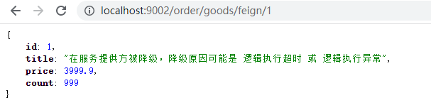
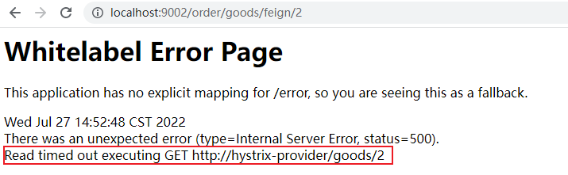
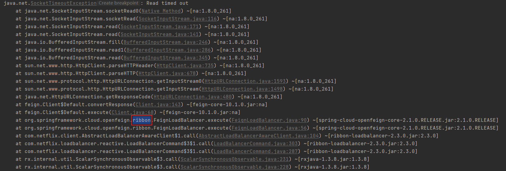
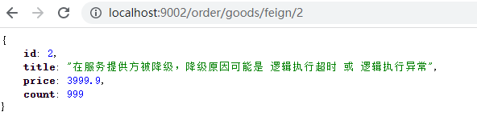

熔断器：为了保护微服务不受侵害

级联失败（雪崩：一个服务失败，导致整个链路服务都失败），A=>B=>C（c出问题了，B就会一直尝试调用C，直到资源耗尽，A也是）

功能：
1.隔离
    1.1 线程池隔离
        如果不隔离，当A先后调用B、C、D（BCD是不同服务），全部的线程都给了B，那么C、D就得不到调用的机会
        每个提供方，消费方为其提供对应的线程池
    1.2 信号量隔离
        每个提供方，消费方都为其提供对应的线程数
2.降级
    服务失败（异常或超时）后，提供友好提示
    1.能访问到服务器，当时服务挂了
    2.网络不通畅，没有访问到服务器
3.熔断
    A调用C，C里面又调用了很多服务，而且这些服务很多都报错，那么就会降级，A调用C就一直报错，就会启动熔断机制
    把C所有的服务都拒绝掉，不管是否能够访问，拒绝之后，C的压力就减少了，可能一会之后，C就能够恢复。
    熔断器在C恢复后，A调用C也会正常调用
4.限流


### 环境搭建

#### 1、完成模块复制
拷贝 “spring-cloud-05-feign 01快速入门”下spring-cloud-parent 到 “spring-cloud-06-hystrix” 降级 或 熔断下

#### 2、feign-consumer，feign-provider模块重命名为hystrix前缀

#### 3、修改pom.xml和application.yml
##### 修改module的名字
spring-cloud-parent的pom.xml
```xml

    <modules>
        <module>hystrix-provider</module>
        <module>hystrix-consumer</module>
        <module>eureka-server</module>
    </modules>

```

consumer模块（port:9002）pom.xml
```xml
<artifactId>hystrix-consumer</artifactId>
```

provider模块（port:9001）pom.xml
```xml
<artifactId>hystrix-provider</artifactId>
```

##### hystrix-consumer，hystrix-provider修改应用名
consumer模块（port:9002）application.yml
```yaml
spring:
  application:
    name: hystrix-consumer
```

provider模块（port:9001）application.yml
```yaml
spring:
  application:
    name: hystrix-provider 
```

#### 4、不用引入hystrix依赖，因为spring-cloud-starter-openfeign已经包含了
但是需要在application.yml中开启hystrix，后面会提到

#### 5、可选，修改服务消费方，OrderController.java，调用url的服务名
FEIGN-PROVIDER 改为 HYSTRIX-PROVIDER

#### 6、修改服务消费方，GoodsFeignClient.java 注解上的服务名
feign-provider 改为 hystrix-provider


### 降级

#### 1、服务提供方降级
服务异常或调用超时，返回默认数据
##### (1) 服务提供方引入hystrix依赖
```xml
    <!-- hystrix -->
     <dependency>
         <groupId>org.springframework.cloud</groupId>
         <artifactId>spring-cloud-starter-netflix-hystrix</artifactId>
     </dependency>
```
##### (2) 定义降级方法
- 方法的返回值需要和原方法一致 
- 方法的参数需要与原方法一样
- 方法名要改

```java
@RestController
@RequestMapping
public class GoodsController {
    // hystrix使用：1.定义降级方法
    public Goods findOne_fallback(int id) {
        Goods one = goodsService.findOne(id);
        one.setTitle("在服务提供方被降级，降级原因可能是 逻辑执行超时 或 逻辑执行异常");
        return one;
    }
}
```


##### (3) 原接口方法上使用@HystrixCommand注解配置降级方法
- fallbackMethod 指定降级后调用的方法 
    - commandProperties {HystrixProperty} 配置属性 属性name HystrixCommandProperties的构造器中
```java
@RestController
@RequestMapping
public class GoodsController {
    
    @GetMapping("/goods/{id}")
    // hystrix使用：2.指定降级方法
    @HystrixCommand(
            fallbackMethod = "findOne_fallback"
    )
    public Goods findOne(@PathVariable("id") int id) throws InterruptedException {
        Goods one = goodsService.findOne(id);

        // 将服务端口添加到返回对象中
        one.setTitle(one.getTitle() + ":" + port);
        return one;
    }
}
```

##### (4) 在启动类上开启Hystrix功能, @EnableCircuitBreaker
```java
// hystrix使用：3.开启Hystrix功能
@EnableCircuitBreaker
public class ProviderApp {}
```

##### (5) 启动测试

依次启动 eureka-server, hystrix-provider, hystrix-consumer

hystrix-provider GoodsController.java 添加 服务提供方降级所需的条件，异常或超时
```java

@RestController
@RequestMapping
public class GoodsController {

    @GetMapping("/goods/{id}")
    // hystrix使用：2.指定降级方法
    @HystrixCommand(
            fallbackMethod = "findOne_fallback"
    )
    public Goods findOne(@PathVariable("id") int id) throws InterruptedException {
        Goods one = goodsService.findOne(id);

        // hystrix使用：4.测试：模拟降级环境
        // 4.1 异常
        //int i = 1/0;
        // 4.2 超时
        Thread.sleep(3000);

        // 将服务端口添加到返回对象中
        one.setTitle(one.getTitle() + ":" + port);
        return one;
    }
}

```

###### 测试结果
①降级条件：异常




②降级条件：超时

结果没有达到预期





原因：http://t.zoukankan.com/wugang-p-14497236.html

逻辑超时并没有触发hystrix降级，而是直接触发 ribbon 的 read timeout，在hystrix-consumer上配置ribbon超时时间ReadTimeout为5s，修改后可以降级

```yaml
ribbon:
  ConnectTimeout: 5000 # 连接超时时间，ms
  ReadTimeout: 5000 # 逻辑超时时间，ms
```



总结：

- hystrix端的超时时间默认为1s，如果业务处理的时间超过就会触发降级方法，前面没有触发降级方法，是因为服务消费方feign中ribbon的超时时间也是1s，没有等到降级响应到服务消费方，就触发了ribbon的超时，抛出了异常，只要将服务消费方的ribbon超时时间配置长一点即可避免上面出现的问题。
- 我们配置ribbon超时时间，但是hystrix默认的超时时间是1s，我们业务处理的时间不可能都小于1s，所以我们该如何解决这个问题呢？(通过注解 @HystrixCommand的commandProperties属性配置 execution.isolation.thread.timeoutInMilliseconds)

```java

@RestController
@RequestMapping
public class GoodsController {


    @GetMapping("/goods/{id}")
    // hystrix使用：2.指定降级方法
    @HystrixCommand(
            fallbackMethod = "findOne_fallback",
            // hystrix使用：5. 配置超时时间，详细name和value可以查看HystrixCommandProperties.java的构造器
            commandProperties = {
                    @HystrixProperty(name="execution.isolation.thread.timeoutInMilliseconds", value = "3000")
            }
    )
    public Goods findOne(@PathVariable("id") int id) throws InterruptedException {
        Goods one = goodsService.findOne(id);

        // hystrix使用：4.测试：模拟降级环境
        // 4.1 异常
        //int i = 1/0;
        // 4.2 超时
        Thread.sleep(3000);

        // 将服务端口添加到返回对象中
        one.setTitle(one.getTitle() + ":" + port);
        return one;
    }

}
```


#### 服务消费方降级
可以使用服务提供方降级的逻辑实现，但是feign中集成了hystrix，它可以简化hystrix降级的处理逻辑
##### (1) 开启feign对hystrix的支持
```yaml
# 开启feign对hystrix的支持
feign:
  hystrix:
    enabled: true
```
##### (2) 定义feign接口实现类，复写方法，即降级方法

```java
@Component
public class GoodsFeignClientFallback implements GoodsFeignClient {
    
    // 重写的方法就是降级方法
    @Override
    public Goods findOne(int id) {
        return new Goods(id, "在服务消费方被降级，原因是建立连接超时", 0.0, 0);
    }
}
```
> 注意：不要忘了加上@Component注解


##### (3) 在@FeignClient注解中使用fallback属性设置降级处理类
```java
@FeignClient(value = "hystrix-provider", fallback = GoodsFeignClientFallback.class)
public interface GoodsFeignClient {}
```

##### (4) 在启动类上开启Hystrix功能, @EnableCircuitBreaker
```java
// hystrix使用：3.开启Hystrix功能
@EnableCircuitBreaker
public class ConsumerApp {}
```

##### (5) 启动测试

依次启动 eureka-server, hystrix-provider, hystrix-consumer

连接超时、逻辑超时和抛异常都可以

#### 同时配置时优先级
优先服务提供方，当服务端宕机采用服务消费方

有个问题：当服务提供方逻辑超时，无论是否设置ribbon时间，都会触发服务提供方的降级方法？？？？？

原因：服务提供方已经降级过，返回给服务消费方已经是正常的响应信息，所以不会触发消费方的降级


### 熔断（机制原理要重新看视频？？？？？）
Hystrix熔断机制，用于监控微服务调用情况，当失败的情况达到预定的阈值（5秒失败20次），会打开断路器，拒绝所有请求，直到服务恢复正常为止

测试（代码看给的）

### 熔断监控

Hystrix 提供不了 Hystrix-dashboard功能，用于实时监控微服务运行状态

Turbine工具聚合监控

#### 搭建Turbine工具搭建
二、修改被监控模块
导入依赖，在低版本不用导入
