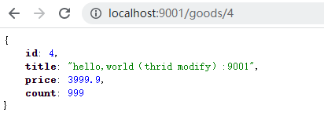

分布式配置中心 https://www.cnblogs.com/qingmuchuanqi48/p/13876035.html
分布式多环境
每个微服务如果都有属于自己的配置文件，我们要改他们相同的配置，那么所有的服务都需要更改，打包测试
### 环境搭建
#### 1、完成模块复制
拷贝 “spring-cloud-06-hystrix 02熔断”下spring-cloud-parent 到 “spring-cloud-08-config 01快速入门”  下

#### 2、hystrix-consumer，hystrix-provider模块重命名为config前缀

#### 3、修改pom.xml和application.yml
##### 修改module的名字
spring-cloud-parent的pom.xml
```xml

    <modules>
        <module>config-provider</module>
        <module>config-consumer</module>
        <module>eureka-server</module>
    </modules>

```

consumer模块（port:9002）pom.xml
```xml
<artifactId>config-consumer</artifactId>
```

provider模块（port:9001）pom.xml
```xml
<artifactId>config-provider</artifactId>
```

##### hystrix-consumer，hystrix-provider修改应用名
consumer模块（port:9002）application.yml
```yaml
spring:
  application:
    name: config-consumer
```

provider模块（port:9001）application.yml
```yaml
spring:
  application:
    name: config-provider 
```

#### 5、可选，修改服务消费方，OrderController.java，调用url的服务名
HYSTRIX-PROVIDER 改为 CONFIG-PROVIDER

#### 6、修改服务消费方，GoodsFeignClient.java 注解上的服务名
hystrix-provider 改为 config-provider


### 快速入门
#### 1、搭建config server
##### （1）使用github或gitee创建远程仓库，上传配置文件


##### （2）新建config-server模块

##### （3）导入ConfigServer依赖
```xml
    <dependencies>
        <!-- config-server -->
        <dependency>
            <groupId>org.springframework.cloud</groupId>
            <artifactId>spring-cloud-config-server</artifactId>
        </dependency>
    </dependencies>
```
##### （4）启动类，启用config功能
```java
@SpringBootApplication
@EnableConfigServer // 启用ConfigServer功能
public class ConfigServer {

    public static void main(String[] args) {
        SpringApplication.run(ConfigServer.class, args);
    }
}
```
##### （5）编写配置，设置github或gitee远程仓库地址
application.yml
```yaml
server:
  port: 8888

spring:
  cloud:
    config:
      server:
        git:
          uri: https://github.com/kaiminliu/springcloud-config.git  # git 的 远程仓库地址
      label: main # 分支配置

  application:
    name:  config-server
```

##### （6）测试访问远程配置文件
仅启动config-server，访问 http://localhost:8888/main/config-dev.yml


更新配置文件


自动刷新，但是出现乱码


##### 解决中文乱码
添加如下配置：
```yaml
server:
  #解决http响应数据中文乱码问题 1
  tomcat:
    uri-encoding: UTF-8
spring:
  #解决http响应数据中文乱码问题 2
  http:
    encoding:
      charset: UTF-8
      force: true
      enabled: true
```


#### 2、搭建config client

修改 config-consumer、config-provider 相关配置
##### （1）导入starter-config依赖
```xml
    <dependencies>
        <!--config client -->
        <dependency>
            <groupId>org.springframework.cloud</groupId>
            <artifactId>spring-cloud-starter-config</artifactId>
        </dependency>
    </dependencies>
```

##### （2）配置config server 地址，读取配置文件名称等信息
bootstrap.yaml 优先级更高，用来加载外部配置，如配置中心的配置信息，也可以用来定义系统不会变化的属性。
创建 bootstrap.yml文件，内容如下：
```yaml
spring:
  # config 配置
  cloud:
    config:
      # config server 地址
      uri: http://localhost:8888
      # 配置文件名字：config-dev.yml
      name: config
      profile: dev
      # 选择分支
      label: main
```

##### （3）创建测试环境，在provider GoodsController获取配置值
```java
@RestController
@RequestMapping
public class GoodsController {

    // 测试：从configServer中获取配置值 1
    @Value("${info}")
    private String info;

    @GetMapping("/goods/{id}")
    @HystrixCommand(
            fallbackMethod = "findOne_fallback",
            commandProperties = {
                    //设置Hystrix的超时时间，默认1s
                    @HystrixProperty(name="execution.isolation.thread.timeoutInMilliseconds",value = "3000"),
                    //监控时间 默认5000 毫秒
                    @HystrixProperty(name="circuitBreaker.sleepWindowInMilliseconds",value = "10000"),
                    //失败次数。默认20次
                    @HystrixProperty(name="circuitBreaker.requestVolumeThreshold",value = "10"),
                    //失败率 默认50%
                    @HystrixProperty(name="circuitBreaker.errorThresholdPercentage",value = "50")
            }
    )
    public Goods findOne(@PathVariable("id") int id) {
        Goods one = goodsService.findOne(id);

        // hystrix熔断测试环境模拟，id为1时，产生异常
        if(id == 1) {
            int i = 1/0;
        }

        // 测试：从configServer中获取配置值 2
        one.setTitle(info);

        // 将服务端口添加到返回对象中
        one.setTitle(one.getTitle() + ":" + port);
        return one;
    }

}

```

##### （4）启动测试
依次启动 config-server、config-provider，访问 http://localhost:9001/goods/2


在线修改配置文件内容


访问 http://localhost:9001/goods/3 发现并没有自动刷新配置


#### 3、客户端刷新
config服务端可以自动刷新，config客户端（config-consumer、config-provider）要配置后才能够刷新，配置如下：

##### （1）引入actuator依赖
```xml
        <!-- actuator -->
        <dependency>
            <groupId>org.springframework.boot</groupId>
            <artifactId>spring-boot-starter-actuator</artifactId>
        </dependency>
```

##### （2）在需要获取配置信息的类上，添加@RefreshScope注解
provider GoodsController.java
```java
@RefreshScope
public class GoodsController {}
```

##### （3）添加配置（啥用?????）
bootstrap.yaml
```yaml
# 暴露refresh端点，也可以直接暴露 *
management:
  endpoints:
    web:
      exposure:
        include: 'refresh'
```
##### （4）使用curl工具发送post请求
curl -X POST http://对应服务ip地址:端口/actuator/refresh
###### 测试示例

依次启动 config-server、config-provider，访问 http://localhost:9001/goods/2


在线修改配置文件内容


访问 http://localhost:9001/goods/3 发现并没有自动刷新配置


手动刷新客户端配置


访问 http://localhost:9001/goods/3 已更新




使用这个只能一次刷新一个微服务，如何刷新多个，那么就需要结合bus使用


本地配置杂用

#### 4、集成eureka（不清楚，理清楚）
##### config server注册到eureka
pom.xml
```xml
<!-- eureka-client  -->
<dependency>
    <groupId>org.springframework.cloud</groupId>
    <artifactId>spring-cloud-starter-netflix-eureka-client</artifactId>
</dependency>
```

启动类开启EurekaClient功能
```java
@EnableEurekaClient
public class ConfigServer {}
```
application.yml
```yaml
# Eureka Config
eureka:
  client:
    service-url:
      defualtZone: http://localhost:8761/eureka # Eureka Server URL，根据实际情况编写
```

##### config client从eureka中访问
bootstrap.yml
```yaml
spring:
  # config 配置
  cloud:
    config:
      # config server 地址
      # uri: http://localhost:8888
      # 配置文件名字：config-dev.yml
      name: config
      profile: dev
      # 选择分支
      label: main
      # 从注册中心去寻找config-server地址
      discovery:
        enabled: true
        service-id: config-server # config server 在 eureka 的 应用名，注释uri =====
```

