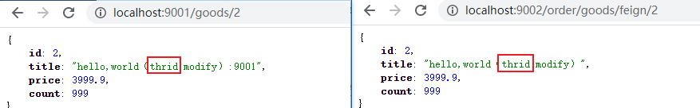
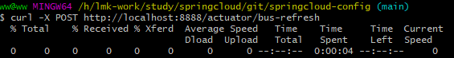
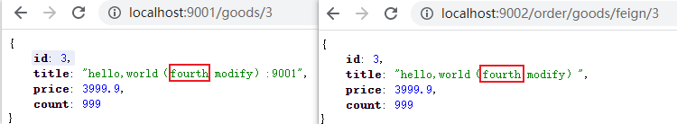

rabbitmq kafka

广播配置文件的更改
/actuator/bus-refresh

### rabbitmq回顾

安装rabbitmq

### 环境搭建
#### 1、完成模块复制
拷贝 “spring-cloud-08-config 01快速入门”下spring-cloud-parent 到 “spring-cloud-09-bus 01快速入门”  下

### 快速入门
只需要引入依赖和配置
#### 1.分别在config-server和config-client中引入bus依赖：bus-amqp
```xml
        <!-- bus -->
        <dependency>
            <groupId>org.springframework.cloud</groupId>
            <artifactId>spring-cloud-starter-bus-amqp</artifactId>
        </dependency>
```

#### 2.分别在config-server（application.yml）和config-client（bootstrap.yml）中配置rabbitmq
```yaml
spring:
  #配置rabbitmq信息
  rabbitmq:
    virtual-host: /
    host: localhost
    username: guest
    password: guest
    port: 5672
```

#### 3.在config-server中设置暴露监控端点：bus-refresh
```yaml
# 暴露bus的刷新端点
management:
  endpoints:
    web:
      exposure:
        include: 'bus-refresh'
```

#### 4.启动测试
依次启动 rabbitmq server、 eureka-server、config-server、config-provider、config-consumer

访问 http://localhost:9001/goods/2 , http://localhost:9002/order/goods/feign/2



在线修改配置文件内容


刷新所有配置文件

curl -X POST http://localhost:8888/actuator/bus-refresh




再次访问 http://localhost:9001/goods/3 , http://localhost:9002/order/goods/feign/3

