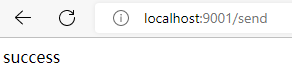
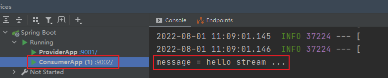

简化消息中间件的使用
要看ppt，Stream架构
### 环境搭建
#### 1、创建spring-cloud-parent模块
pom.xml
```xml
<?xml version="1.0" encoding="UTF-8"?>
<project xmlns="http://maven.apache.org/POM/4.0.0" xmlns:xsi="http://www.w3.org/2001/XMLSchema-instance"
         xsi:schemaLocation="http://maven.apache.org/POM/4.0.0 http://maven.apache.org/xsd/maven-4.0.0.xsd">
    <modelVersion>4.0.0</modelVersion>

    <parent>
        <groupId>org.springframework.boot</groupId>
        <artifactId>spring-boot-starter-parent</artifactId>
        <version>2.1.0.RELEASE</version>
        <relativePath/>
    </parent>

    <groupId>cn.liuminkai</groupId>
    <artifactId>spring-cloud-parent</artifactId>
    <packaging>pom</packaging>
    <version>1.0-SNAPSHOT</version>

    <dependencies>
        <dependency>
            <groupId>org.springframework.boot</groupId>
            <artifactId>spring-boot-starter-test</artifactId>
        </dependency>
    </dependencies>
    <properties>
        <project.build.sourceEncoding>UTF-8</project.build.sourceEncoding>
        <project.reporting.outputEncoding>UTF-8</project.reporting.outputEncoding>
        <java.version>1.8</java.version>
        <spring-cloud.version>Greenwich.RELEASE</spring-cloud.version>
    </properties>

    <dependencyManagement>
        <dependencies>
            <dependency>
                <groupId>org.springframework.cloud</groupId>
                <artifactId>spring-cloud-dependencies</artifactId>
                <version>${spring-cloud.version}</version>
                <type>pom</type>
                <scope>import</scope>
            </dependency>
        </dependencies>
    </dependencyManagement>

</project>

```

#### 2、创建子模块 stream-provider
```java
@SpringBootApplication
public class ConsumerApp {

    public static void main(String[] args) {
        SpringApplication.run(ConsumerApp.class, args);
    }
}
```
```yaml
server:
  port: 9992
```
#### 3、创建子模块 stream-consumer
```java
@SpringBootApplication
public class ProviderApp {

    public static void main(String[] args) {
        SpringApplication.run(ProviderApp.class, args);
    }
}
```
```yaml
server:
  port: 9991
```


### 消息生产者
#### 1、创建消息生产者模块，引入依赖
模块已创建，引入依赖
```xml
    <dependencies>
        <!--spring boot web-->
        <dependency>
            <groupId>org.springframework.boot</groupId>
            <artifactId>spring-boot-starter-web</artifactId>
        </dependency>
        <!-- stream -->
        <dependency>
            <groupId>org.springframework.cloud</groupId>
            <artifactId>spring-cloud-starter-stream-rabbit</artifactId>
        </dependency>
    </dependencies>
```
#### 2、编写配置，定义builder，和bindings
stream.binders:
    名字可以随便取（自定义绑定器名称）：
        type: 绑定器类型（rabbit）
stream.bindings:
    output： channel
    destination: exchange
```yaml
spring:
  cloud:
    stream:
      # 定义绑定器，绑定到哪个消息中间件上
      binders:
        # 自定义的绑定器名称
        my_binder:
          type: rabbit # 绑定器类型
          environment: # 指定mq的环境
            spring:
              #配置rabbitmq信息
              rabbitmq:
                virtual-host: /
                host: localhost
                username: guest
                password: guest
                port: 5672
      bindings:
        output: # channel名称
          binder: my_binder #指定使用哪一个binder
          destination: my_exchage # 消息目的地
```

#### 3、定义消息发送业务类。添加@EnableBinding(Sourse.class)，注入MessageChannel output，完成消息发送
```java
// 1 创建消息发送类，绑定 通道 "output"，并转载到spring容器中
@Component
@EnableBinding(Source.class)
public class MessageSend {

    // 2 注入 消息通道 "output"
    @Autowired
    public MessageChannel output;

    // 3 编写消息发送方法
    public void send() {
        output.send(MessageBuilder.withPayload("hello stream ...").build());
    }
}

```

```java
// 4 使用 消息通道 "output" 发送消息
@RestController
@RequestMapping("send")
public class SendController {

    @Autowired
    private MessageSend messageSend;

    @GetMapping
    public String send(){
        messageSend.send();
        return "success";
    }
}
```


### 消息消费者

#### 1、创建消息消费者模块，引入依赖
```xml
    <dependencies>
        <!--spring boot web-->
        <dependency>
            <groupId>org.springframework.boot</groupId>
            <artifactId>spring-boot-starter-web</artifactId>
        </dependency>
        <!-- stream -->
        <dependency>
            <groupId>org.springframework.cloud</groupId>
            <artifactId>spring-cloud-starter-stream-rabbit</artifactId>
        </dependency>
    </dependencies>
```

#### 2、编写配置，定义builder，和bindings
```yaml
spring:
  cloud:
    stream:
      # 定义绑定器，绑定到哪个消息中间件上
      binders:
        # 自定义的绑定器名称
        my_binder:
          type: rabbit # 绑定器类型
          environment: # 指定mq的环境
            spring:
              #配置rabbitmq信息
              rabbitmq:
                virtual-host: /
                host: localhost
                username: guest
                password: guest
                port: 5672
      bindings:
        input: # channel名称
          binder: my_binder #指定使用哪一个binder
          destination: my_exchage # 消息目的地
```

#### 3、定义消息接受业务类。添加@EnableBinding(Sink.class)，注入MessageChannel input，完成消息接受
```java
// 1.创建消息接收类，绑定通道 input，并转载到spring容器中
@Component
@EnableBinding(Sink.class)
public class MessageReceive {

    // 2.监听 来自通道 input 的消息
    @StreamListener(Sink.INPUT)
    public void receive(Message message) {
        System.out.println("message = " + message.getPayload());
    }
}
```

### 启动测试
启动rabbitmq server、stream-provider、stream-consumer，访问 http://localhost:9001/send 




