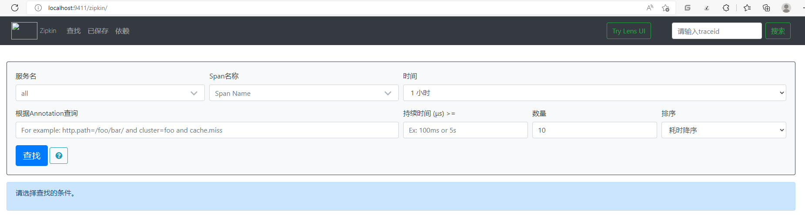

### 环境搭建
直接复制 bus 01快速入门

### 快速入门
1.安装启动zipkin
java -jar zipkin-server-2.12.9-exec.jar

2.访问界面 http://localhost:9411/



3.在服务提供方和消费方分别引入sleuth 和 zipkin依赖
```xml
        <!-- sleuth-zipkin -->
        <!--<dependency>
            <groupId>org.springframework.cloud</groupId>
            <artifactId>spring-cloud-starter-sleuth</artifactId>
        </dependency>-->

        <dependency>
            <groupId>org.springframework.cloud</groupId>
            <artifactId>spring-cloud-starter-zipkin</artifactId>
        </dependency>
```


4.分别配置服务提供方和消费方
```yaml
spring:
  zipkin:
    base-url: http://localhost:9411/  # 设置zipkin的服务端路径

  sleuth:
    sampler:
      probability: 1 # 采集率 默认 0.1 百分之十。
```