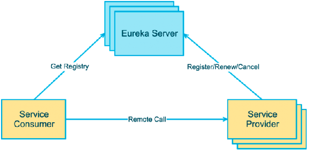

# Eureka

- Eureka 是 Netflix 公司开源的一个服务注册与发现的组件 。
- Eureka 和其他 Netflix 公司的服务组件（例如负载均衡、熔断器、网关等） 一起，被 Spring Cloud 社区整合为 Spring-Cloud-Netflix 模块。 
- Eureka 包含两个组件：Eureka Server (注册中心) 和 Eureka Client (服务提供者、服务消费者)。

